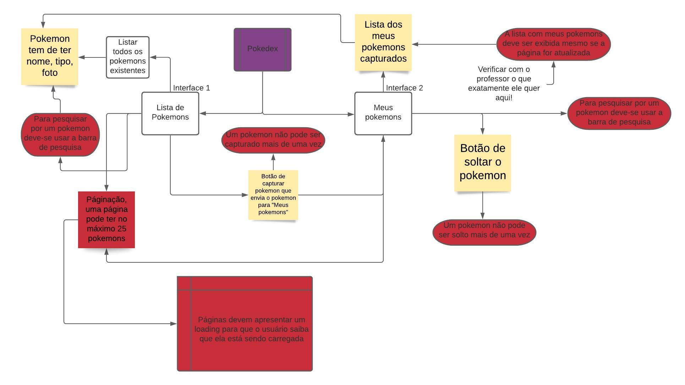

	
	<h1 align="center"> ✨Pokedex-Gama✨ </h1>

---

#### A aplicação foi solicitada como primeiro projeto do WeCanCodeAcademy. Usando o  [ReactJS](https://www.facebook.com/wendyanna.lopes/), temos que consumir a API de  [Pokémon](https://pt-br.reactjs.org/), abaixo o fluxo da aplicação para que possam ter um melhor entendimento do que foi solicitado.

	

